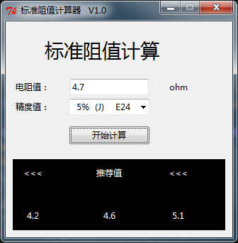
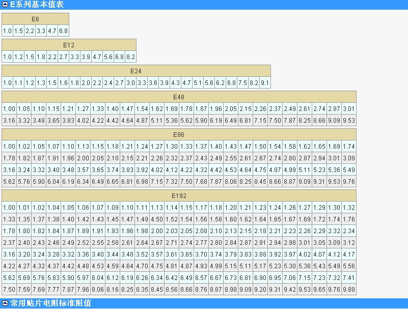

# 电阻、电容、电感值选型模块
## RCL_Value Selection Tool

>当前工具主要是根据相关标准计算并显示出匹配当前值的标准值，方便大家选型的时候提高准确度。<br />本工具选用标准为EIA 的 E 系列标准。<br />封装选型主要根据当前确定的电参数加上允许波动范围，与各封装对应功耗进行对比，然后选择。
<br />

<br />
**标准电阻计算器操作界面**<br />

**使用说明：**<br />
1. 在“精度值”下拉列表框中选择需要的精度值；
1. 在电阻值输入框中输入需要匹配的电阻值（电路设计时计算出来的电阻值）；
1. 点击“开始计算”按钮；
1. 下方黑色区域显示计算结果，中间的为推荐值，左侧为小一级的值，右侧为大一级的值。
<br /><br /><br />
```
注意:
    本程序计算值仅供参考，与标准值列表中的值仍有误差。
```

<br /><br />
以下为网络搜集到的标准电阻基础值表：<br />
<br />
